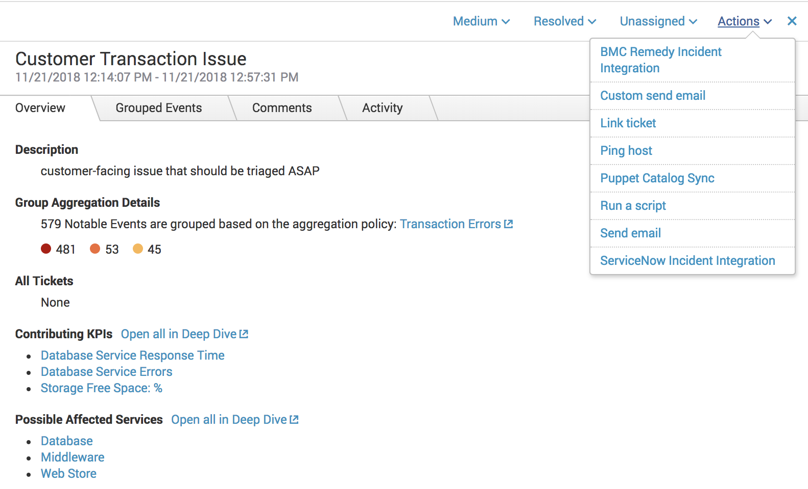

# Splunk ITSI Deep Dive Email Alert

> This will provide Splunk ITSI users the ability to send an email alert of underlying Deep Dives (KPIs and Services) of a Notable Event.

## Pre-requisites
* Required libraries ([if not already installed](http://dev.splunk.com/view/python-sdk/SP-CAAAEDG)):
  * [Splunk SDK for Python](http://dev.splunk.com/python)
* Access to your Splunk instance via UI as well as via SSH
* Configure your Splunk instance to send email notification (if not already done)
  * From the home page, select *Settings > Server settings > Email settings*
  * In *Mail Server Settings* specify **mail host**, **email security**, **username** and **password**.
  * In *Email Format Settings* specify **Send email as**
  * Save your changes

## Installation
* Edit `bin/itsi_deepdive_email.py`
```python
# at line 22-23
HOST = '!! Please add your Splunk instance host here (e.g. mysplunk.instance.io) !!'
PORT = '!! Please add its port here (e.g. 8000) !!'
```
* Edit `bin/itsi_deepdive_email_utils.py`
```python
# at line 3-6
HOST = "localhost"
PORT = 8089
USERNAME = "!! Please provide your username here (e.g. admin) !!"
PASSWORD = "!! Please provide your password here (e.g. admin) !!"
```
* If not already existing, copy `local/*.conf` into a local version of `$SPLUNK_HOME/etc/apps/SA-ITOA/default/notable_event_actions.conf` and `$SPLUNK_HOME/etc/apps/SA-ITOA/default/alert_actions.conf`
> If files do already exist, just add `local/*.conf` stanzas into the corresponding ones

* Copy `local/data/ui/alerts/itsi_deepdive_email.html` to `$SPLUNK_HOME/etc/apps/SA-ITOA/local/data/ui/alerts`
> Create the whole path if not existing

* Add stanzas of `README/*.spec` into `$SPLUNK_HOME/etc/apps/SA-ITOA/README/alert_actions.conf.spec` and `$SPLUNK_HOME/etc/apps/SA-ITOA/README/savedsearches.conf.spec` respectively
* Copy `bin/*` to `$SPLUNK_HOME/etc/apps/SA-ITOA/bin` and make sure their ownership and permissions are as shown below
```bash
# Verify
~$ cd $SPLUNK_HOME/etc/apps/SA-ITOA/bin
~$ ls -la | grep email
-rw-r--r--.  1 root root  1938 Nov 21 09:55 itsi_deepdive_email_utils.py
-rw-r--r--.  1 root root  5402 Nov 21 09:55 itsi_deepdive_email.py
# Change permissions
~$ chmod 644 itsi_deepdive_email.py
~$ chmod 644 itsi_deepdive_email_utils.py
# Change ownership
~$ chown root:root itsi_deepdive_email.py
~$ chown root:root itsi_deepdive_email_utils.py
```
* Restart `splunk` service

## Usage
* Login into your Splunk instance
* Enter the app *IT Service Intelligence* among available ones
* Select *Notable Events Review* from the navigation bar
* Click on the event you want to send a custom email from
* Click on *Actions > Custom send email* as shown 
* Configure the action by filling fields such as
  * To: Email recipient
  * Subject: Email subject
* Press *Done*

## References
* Notable Events
    * [Notable Event Actions SDK reference](http://docs.splunk.com/Documentation/ITSI/4.0.3/Configure/NotableEventsActionSDKreference)
    * [Set up custom episode actions](https://docs.splunk.com/Documentation/ITSI/latest/User/Setupandrunnotableeventactions#Set_up_custom_episode_actions)
* Send Email
    * [Sendemail command](http://docs.splunk.com/Documentation/Splunk/7.2.1/SearchReference/Sendemail)
    * [Configure email notification](https://docs.splunk.com/Documentation/Splunk/7.2.0/Alert/Emailnotification#Configure_email_notification_for_your_Splunk_instance)

## Acknowledgements
Thanks to [Martin Wiser's example](https://github.com/mwiser/splunk-itsi-customemailalert) for providing a good  solid basis for the development of this custom email alert in ITSI.

## Contributors

Curious to know who the authors are? [Check them out](https://github.com/splunk/itsi-deep-dive-email-alert/blob/master/AUTHORS.md)!

## EOF

* **:heart: it?** Tweet here : [`@splunk`](https://twitter.com/splunk) or email us at [`fdse [@] s p l u n k {.} C O M`](mailto:fdse@splunk.com?subject=[Splunk-ITSI-DeepDiveAlert]%20Hi%20there!).

* Want to **contribute**? Great! Feel free to create a [PR](https://github.com/splunk/itsi-deep-dive-email-alert/pulls).

* **Found a bug?** [Open an issue](https://github.com/splunk/itsi-deep-dive-email-alert/issues/new)
